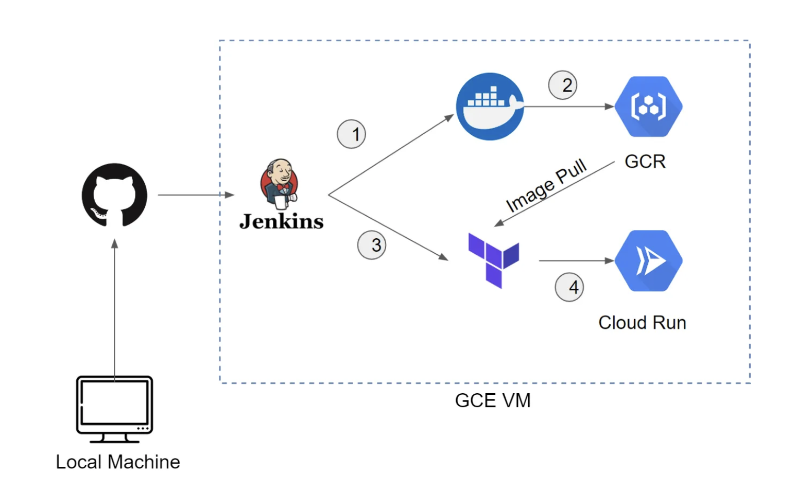
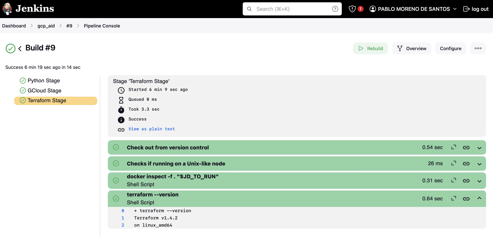

# AIDaaS
## Artificial Intelligence and Data DevOps as a Service

This repository provides a "Hello World" template for:

- **CI/CD Pipeline with Jenkins**: Automate the continuous integration and continuous delivery pipeline for your application.
- **Testing and Code Coverage**: Run tests and monitor code coverage to ensure quality and reliability.
- **Infrastructure as Code with Terraform**: Define and provision cloud infrastructure using Terraform.
- **Docker Image Creation**: Build Docker images for your code artifacts to enable containerized deployment.
- **Google Cloud Deployment**: Deploy both infrastructure and code artifacts to Google Cloud, leveraging services such as Google Cloud Run.

